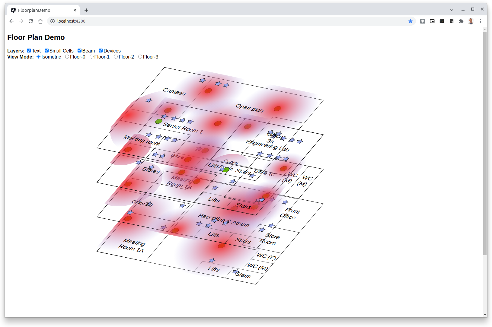

# floorplan-demo
simple demo of viewing floor plans in 2.5D

This example contains 4 floor drawings.

## Usage
* Clone this repo
* `cd` in to the floorplan-demo folder
* Install NodeJS if you don't have it
* Install Angular [globally](https://angular.io/guide/setup-local#install-the-angular-cli) if you don't have it
* Run `npm install` to install the packages
* Run `ng serve --open` to view the demo

## Notes
Each drawing has created in Inkscape on a 300x200 mm page.

It used Inkscape layers "Walls", "Text", "SmallCells" (with a sublayer of "Base"), and "Devices".

When imported in to this project the:

* `<sodipodi:namedview>` and `<metadata>` sections were removed
* the following was added to each layer display statement `     [style]="layers.includes('Layer name') ? 'display:inline' : 'display:none'">`

The original SVG files are in the [images](docs/images/inkscape-originals) folder.

In future the SVG could be loaded from a REST location,
cleaned up as described above and the Floor<n> component,
compiled dynamically
